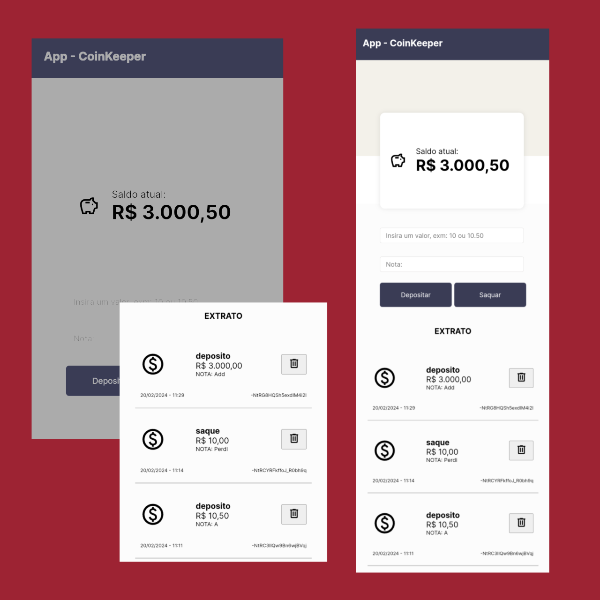

<div align="center" display="flex" flex-direction="column">
  
  <h1>CoinKeeper</h1>
  <p>
  Para minha Mãe, que sempre esquece quanto dinheiro ela esta juntando e se nega a criar uma conta no banco
  </p>

  <div align="center" gap="5px">
      
      
      
      
  </div>
</div>

# CoinKeeper

App particular de registros financeiros, uma solução simples para gerenciar ganhos e gastos. Utilizando um banco de dados em tempo real o app possibilita inserir e visualizar suas transações instantaneamente, mantendo seu orçamento sempre atualizado e organizado."

# licença 


# instalação

```shell
 npm install
 npm run dev
```
# Real-time database Firebase 

após a instalação é necessário criar um banco de dados NoSQL com o firebase que ficará responsável por armazenar as informações e disponibiliza-lás em tempo real para o usuário, para isso em acesse: 

[Firebase.google.com](https://firebase.google.com/)

depois de criar uma conta clique em começar para ser redirecionado para o console do firebase e crie um novo projeto, 
exemplo minha-poupança. não será necessário authentificação então pode desmarcar esta função. recomendo que de resto mantenha o padrão e confirme a criação do projeto.

concluido procure no painel a opção que diz "Realtime database" e crie um banco de daos, após concluir a criação do banco o firebase irá disponibilizar uma URL de acesso ao banco. essa URL é necessário incluir no projeto

vá na pasta src, dentro da pasta services há um arquivo chamdo DB.ts

```typescript
const firebaseConfig = {
  databaseURL: "" // Adicione sua URL de conexão com o firebase aqui
}

const App = initializeApp(firebaseConfig);
const DB = getDatabase(App);
``` 
e pronto. agora está disponivel para uso.

# como usar

a ideia do App é ser o mais simples possivel, nele você simplesmente informa o valor que que adicionat ou remover e o app se encarrega de enviar os dados para o banco de dados firebase, exibindo em tela o valor corrente e um historico de atividades.



# Apêndice 

o app simplesmente gurada informações, não há sistema de login com authentificação, apenas uma lista que qualuer usuário pode modificar e como se trata de dados não sensiveis não vi motivo para utilizar sistemas de segurança para esses dados.